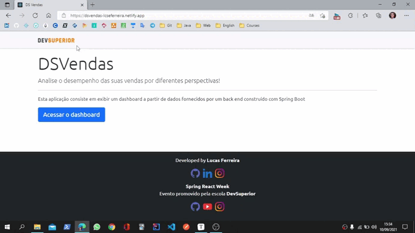

<h1 align="center">
    Spring React Week 
</h1>
<h3 align="center">
    Preview
</h3>

<h3>
    About
</h3>

    This is a project developed during <strong>Spring React Week</strong>. A web app was developed with <strong>Java and Spring</strong> on the back end and <strong>ReactJS</strong> on the front end. 

<h3>Languages and Tools</h3>

 
    
    
    
             

 

